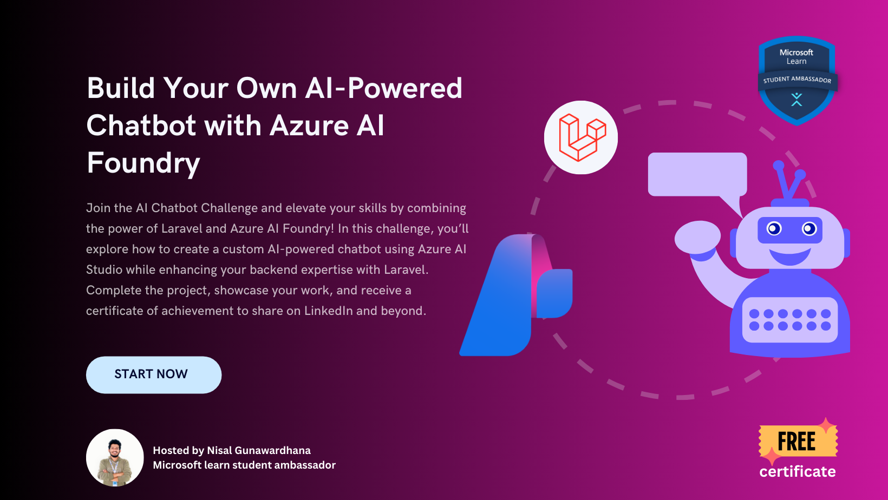
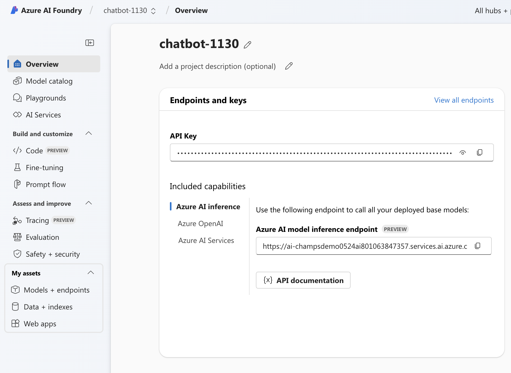

# Build Your Own AI-Powered Chatbot with Azure AI Foundry 🤖💡

## Description

Join the AI Chatbot Challenge and elevate your skills by combining the power of Laravel and Azure AI Foundry! In this challenge, you’ll explore how to create a custom AI-powered chatbot using Azure AI Studio while enhancing your backend expertise with Laravel. Complete the project, showcase your work, and receive a certificate of achievement to share on LinkedIn and beyond. 📜🎓


## Benefits of Participating 🎁

By joining this challenge, you will:

- Earn a certificate of achievement to showcase your skills.
- Stand a chance to win LinkedIn Premium vouchers.
- Gain hands-on experience with Azure AI Foundry.
- Have the opportunity to win Azure free vouchers.
- Enhance your backend development skills with Laravel.
- Expand your professional network and career opportunities.

## Step 01
## Getting Started with Azure AI Foundry 🚀

First, start learning with Azure AI Foundry by completing the Azure AI Foundry learning path: [Create Custom Copilots with AI Studio](https://learn.microsoft.com/training/paths/create-custom-copilots-ai-studio?wt.mc_id=studentamb_365539)

## How to Get Azure Free Credit with Student Sign-Up 🎓💳

As a student, you can get free Azure credits by signing up for the Azure for Students offer. Follow these steps to get started:

1. **Visit the Azure for Students Page**: Go to the [Azure for Students](https://azure.microsoft.com/en-us/free/students/) page.
2. **Sign Up with Your School Email**: Click on the "Activate now" button and sign up using your school email address.
3. **Verify Your Student Status**: Follow the instructions to verify your student status. You may need to provide additional information or documentation.
4. **Receive Your Free Credits**: Once your student status is verified, you will receive $100 in Azure credits, which you can use for various Azure services.

With these credits, you can explore and use Azure services to build and deploy your projects without any cost. Happy learning and building!

## Step 02
## Setting Up the Chatbot 🛠️

## How to Fork this Repository 🍴

To fork this repository, follow these steps:
1. Navigate to the repository on GitHub.
2. Click the "Fork" button in the top right corner of the page.
3. Choose your GitHub account to fork the repository.

## How to Clone to Local PC 💻

To clone the forked repository to your local PC, follow these steps:
1. Open your terminal or command prompt.
2. Run the following command, replacing `your-username` with your GitHub username:
    ```bash
    git clone https://github.com/nisalgunawardhana/ChatBot-Challenge-By-NisalGunawardhana.git
    ```
3. Navigate to the cloned directory:
    ```bash
    cd ChatBot-Challenge-By-NisalGunawardhana
    ```

## Setting Up Environment Variables 🌐

To set up your environment variables, follow these steps:
    
1. Copy the `.env.example` file to create a new `.env` file:
    ```bash
    cp .env.example .env
    ```
    
2. Open the `.env` file in your preferred text editor.
    
3. Uncomment the `AZURE_URL` and `API_KEY` lines by removing the `#` at the beginning of the lines and provide the appropriate values:
    ```env
    AZURE_URL=your_azure_url
    API_KEY=your_api_key
    ```

## Finding Your Azure AI Studio API Key and Endpoint 🔑

To find your Azure AI Studio API key and endpoint, follow these steps:

1. Sign in to the [Azure AI Foundry](https://ai.azure.com/).
2. Navigate to your Project.
3. In the left-hand menu, select the "Overview" section.
4. You will see your API keys and endpoint URL listed on this page. Copy these values to use in your `.env` file.



## Step 03
## Submit Project and Get Certificate 🎉🏆

After completing the project, submit it to receive your certificate. Follow these steps:

1. Ensure you have completed the learning path and attached the completion badge.
2. Enter your correct name and email address.
3. Provide your LinkedIn profile URL.
4. Include the link to your forked repository.

## Chance to Win LinkedIn Premium Vouchers 🎁

By participating in this challenge, you also stand a chance to win LinkedIn Premium vouchers! Showcase your project, complete the submission form, and you might be one of the lucky winners to receive a LinkedIn Premium voucher to boost your professional network and career opportunities.

Fill out the submission form here: [Google Form](https://forms.gle/JHWgNUQkyPTb9HSh8)

## Prerequisites 📋

Before running the project, ensure you have the following installed:

- **Laravel**: A PHP framework for web artisans. [Laravel Documentation](https://laravel.com/docs)
    
## Helpful YouTube Videos for Setting Up Laravel 🎥

Here are some YouTube videos to help you with setting up a Laravel development environment:

- [How to Install Laravel on Windows](https://www.youtube.com/watch?v=MFh0Fd7BsjE)
- [How to Install Laravel on macOS](https://www.youtube.com/watch?v=4q0gYjAVonI)
- [How to Install Laravel on Ubuntu](https://www.youtube.com/watch?v=ImtZ5yENzgE)

- **PHP >= 8.0**: A popular general-purpose scripting language that is especially suited to web development. [PHP Documentation](https://www.php.net/docs.php)
- **Composer**: A dependency manager for PHP. [Composer Documentation](https://getcomposer.org/doc/)
- **Node.js & npm**: Node.js is a JavaScript runtime built on Chrome's V8 JavaScript engine, and npm is the package manager for Node.js. [Node.js Documentation](https://nodejs.org/en/docs/)
- **A web server like Xampp or Nginx**: Xampp is an easy-to-install Apache distribution containing MySQL, PHP, and Perl. Nginx is a high-performance HTTP server and reverse proxy. [Xampp Documentation](https://www.apachefriends.org/index.html) | [Nginx Documentation](https://nginx.org/en/docs/)

To set up the project, follow these steps:

1. **Install PHP**: Follow the instructions in the PHP documentation to install PHP on your system.
2. **Install Composer**: Download and install Composer by following the instructions in the Composer documentation.
3. **Install Node.js & npm**: Download and install Node.js, which includes npm, by following the instructions in the Node.js documentation.
4. **Set up a web server**: Install and configure a web server like Xampp or Nginx by following the respective documentation.

Once you have all the prerequisites installed, you can proceed with cloning the repository and setting up the environment variables as described in the previous sections.

## Helpful YouTube Videos for Installation 🎥

Here are some YouTube videos to help you with the installation process:

1. **Installing PHP on Windows/Mac/Linux**:
    - [How to Install PHP on Windows 10](https://www.youtube.com/watch?v=OK_JCtrrv-c)
    - [How to Install PHP on macOS](https://www.youtube.com/watch?v=y3hLXe0rfn4)
    - [How to Install PHP on Ubuntu](https://www.youtube.com/watch?v=K5n1k0p-5e0)

2. **Installing Composer**:
    - [How to Install Composer on Windows](https://www.youtube.com/watch?v=1K77xg8JH0Y)
    - [How to Install Composer on macOS](https://www.youtube.com/watch?v=Tf5jz4ZkGfw)
    - [How to Install Composer on Ubuntu](https://www.youtube.com/watch?v=8QnZ3QhUqXM)

3. **Installing Node.js and npm**:
    - [How to Install Node.js and npm on Windows](https://www.youtube.com/watch?v=kQabFyl9r9I)
    - [How to Install Node.js and npm on macOS](https://www.youtube.com/watch?v=Imj8PgG3bZU)
    - [How to Install Node.js and npm on Ubuntu](https://www.youtube.com/watch?v=kYtRSSpUduw)

4. **Setting Up a Web Server**:
    - [How to Install XAMPP on Windows](https://www.youtube.com/watch?v=h6DEDm7C37A)
    - [How to Install XAMPP on macOS](https://www.youtube.com/watch?v=CCENlDeGvv8&t=254s)
    - [How to Install Nginx on Ubuntu](https://www.youtube.com/watch?v=7YqlP7HYU1g)

## License 📄

This project is licensed under the MIT License. You are free to use it for educational purposes.
The Laravel framework is open-sourced software licensed under the [MIT license](https://opensource.org/licenses/MIT).

## Follow Me 🌐

Stay connected and follow me on social media for updates and more:

- [GitHub](https://github.com/nisalgunawardhana)
- [Twitter](https://twitter.com/thenisas)
- [Facebook](https://web.facebook.com/thenisals/)
- [LinkedIn](https://www.linkedin.com/in/nisalgunawardhana/)
